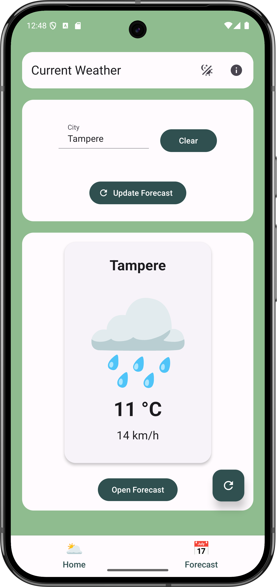
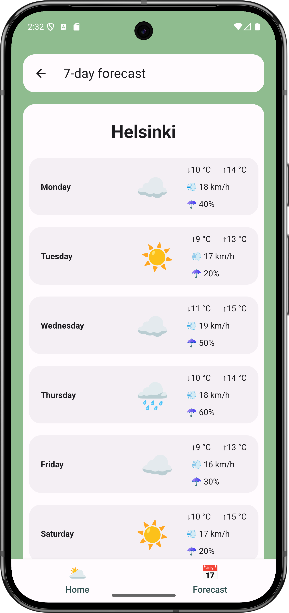
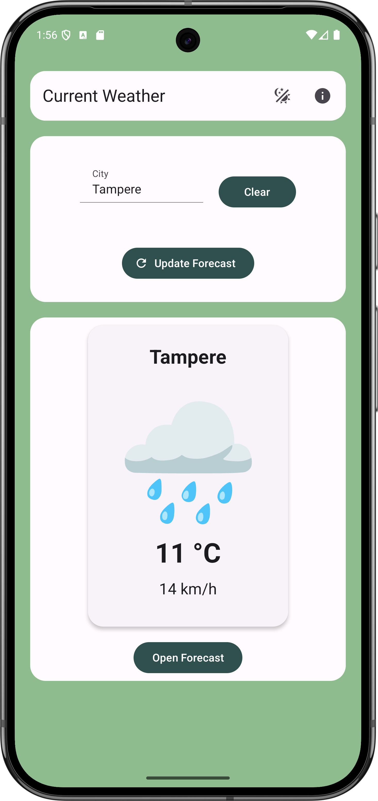
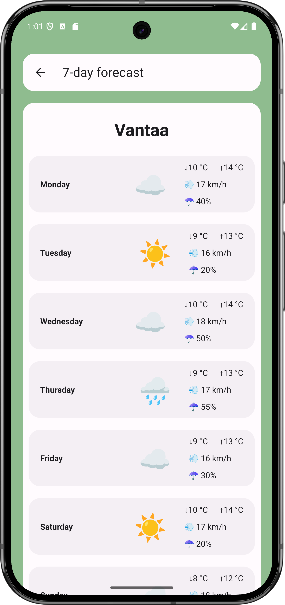
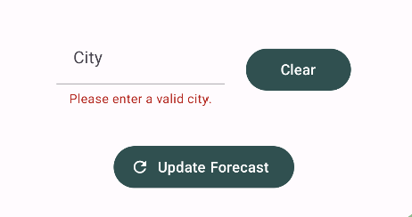
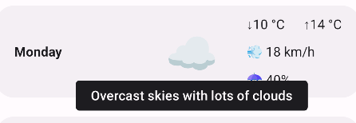

 # Mobile Applications 2
## 3rd Week Exercises

### Exercise 1

- Used the `CityInput` component from the last exercise and moved it to the new component `CityPanel`.
- Moved the city handling logic to the screen.
- Updated the mock data to contain multiple cities and current weather data for them.
- Implemented city search logic in the screen and added a text to `WeatherPanel` component if the entered city could not be found.
- Implemented updating the weather data (from the mock data) when a new city is selected.

### Exercise 2

- Implemented navigation in the `App.js` file.
- Updated mock data to include 7-day forecasts for the different cities.
- Updated existing components to match the new mockup data structures.
- Added forecast screen with a `FlatList` containing information for the forecast in the next 7 days.
- Tried bottom tab navigation and stack navigation (see screenshots). Personally, I preferred the tab navigation, since it always gave the user a visual indication of which screen the application was currently on.

#### Screenshots

| Home (Tab) | Forecast (Tab) | Home (Stack) | Forecast (Stack) |
|------------|----------------|--------------|-----------------|
|  |  |  |  |

### Exercise 3

- Added `HelperText` component from React Native Paper to `CityInput` component when the input field is empty.
- Added short description for each weather condition in the mock data.
- Used `Tooltip` component from React Native Paper to display the additional weather condition in the forecast screen when holding on the condition emoji.

#### Screenshots

| HelperText | Tooltip |
|------------|---------|
|  |  |

### Personal findings and lessons

- Passing data between screens was sometimes confusing; figuring out when to use `props` and when to use `initialParams` took extra time.
- Styling behaves differently across Android, iOS, and Web, so sometimes small adjustments were needed to achieve a consistent look.
- Making changes to the structure of the mock data meant that the code also had to be changed in multiple places, and it was somewhat confusing to find all the affected spots.
- Styling the tab bar navigation was not straightforward; combining `screenOptions`, `options`, and theme colors required experimentation to achieve the desired look.
